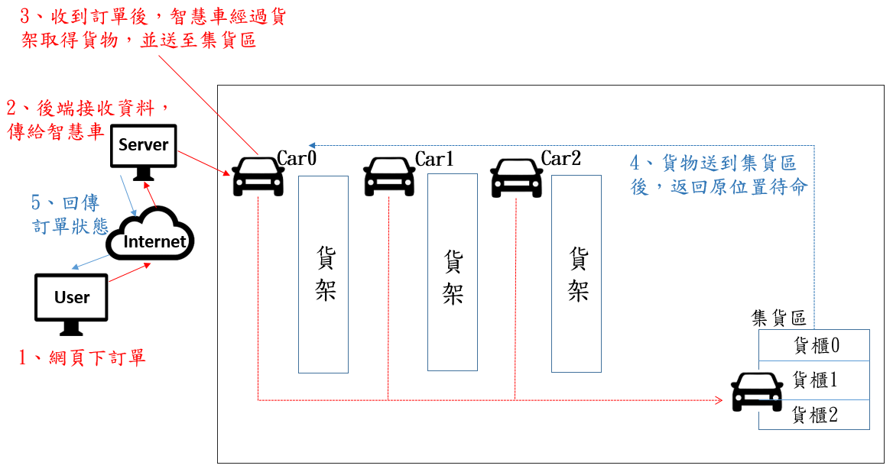
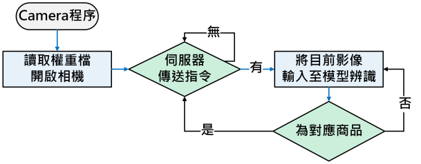
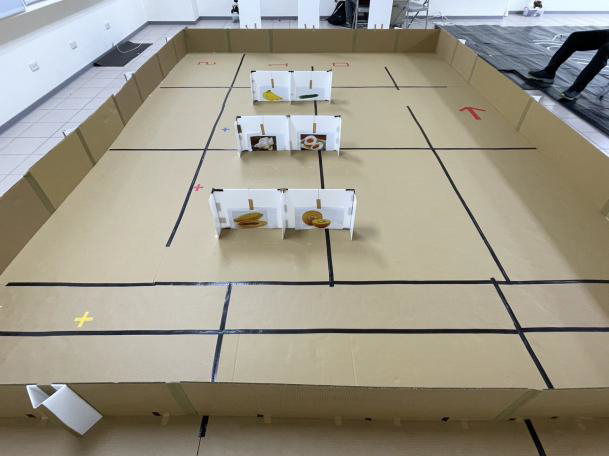

# 無人超市 — Staffless-Store-Simulation

> 結合網站、LiDAR(SLAM)、MySQL、ROS 與 YOLOv5 的自動取貨系統。  

## 目錄 (Table of Contents)
  
- [快速連結](#快速連結)
- [專案簡介](#專案簡介)
- [流程圖](#流程圖)
- [實際Demo](#實際demo)
- [特色](#特色)
- [技術棧](#技術棧)
- [貢獻者](#貢獻者)
---

## 快速連結
- 報告 (PDF)：[report.pdf](report.pdf)
  
- [專題成果展示](https://www.csie.ncue.edu.tw/csie/3th_grade_project_form/project.php?id=group_114_01)
---
## 專案簡介
本專案實作一套以使用者操作便利為導向的無人超市系統，包含：
- 前端網站 (PHP, Bootstrap, JS)：商品瀏覽、下單、管理介面  
- 後端 API (Node.js) 與 MySQL：訂單、庫存、狀態回報  
- 小車控制 (ROS, Multi-Master) 與 LiDAR：場域地圖、路徑規劃  
- 影像辨識 (YOLOv5)：商品辨識以提高取貨準確率
---
## 流程圖

   

  

前後端互動式意圖

   

  

小車系統示意圖

   

  

車輛派遣系統示意圖

   

  

Yolov5 辨識流程圖

   

  

測試場地

---

## 實際Demo
   

  
  
<b>示範影片</b>

   

---

## 特色
- 模組化 (前端 / 後端 / 機器人) 便於開發與維護  
- 即時 API 回報小車狀態  
- 支援多台小車協同作業 (namespace + multi-master)
---

## 技術棧
- 前端：HTML, CSS, Bootstrap, JavaScript, PHP  
- 後端：Node.js, Express  
- 資料庫：MySQL  
- 機器人：ROS, LiDAR (SLAM)  
- 影像辨識：YOLOv5

---

## 設備
- Server：Jetson orin nano developer kit  
- Car : Jetson nano + RPLidar A1 + Jetbot

---

## 貢獻者
- 指導教授：[丁德榮(Der-Rong Din)](https://webap1s.ncue.edu.tw/ET/Apps/HR/HonorBolg.aspx?id=deron#PostGraduate)
- 陳佑丞、王長盛、呂長遠、賴宏運、范育誌、王楷儒
